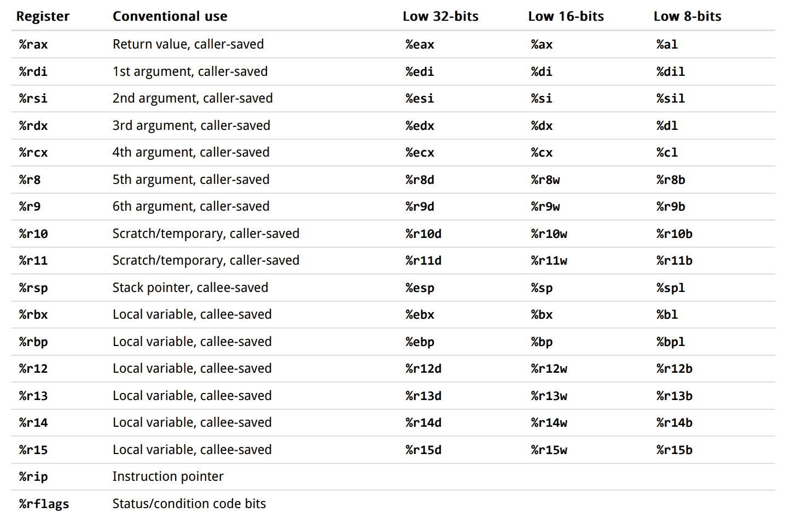

# Linux-0.11 on x86 and x64

The modified old Linux kernel source ver 0.11 to port to x86_64 system forked
from yuan-xy/Linux-0.11.

## 1. Build on Linux

### 1.1. Linux Setup
* a linux distribution: debian, ubuntu and mint are recommended
* some tools: gcc gdb qemu
Pass test on Ubuntu 16.04 and 22.04.

1. Modify the target in `Makefile.header` to indicate the architecture
2. Run the following codes
```bash
$ make
$ make start
```

### 1.2. hack linux-0.11
```bash
$ make help     // get help
$ make          // compile
$ make start    // boot it on qemu
$ make debug    // debug it via qemu with gdb or lldb
```

```bash
$ make sofar    // make the compilable part of the x86_64 system so far
```

lldb(recommended):

```lldb
$ lldb tools/system
(lldb) gdb-remote 1234
(lldb) b main
(lldb) c
```

or
```bash
make lldb-as    // debug assembly
make lldb-src   // debug with source
```

gdb:

```gdb
$ gdb tools/system
(gdb) target remote :1234
(gdb) b main
(gdb) c
```

Hints:
1. You may use [bear](https://github.com/rizsotto/Bear) to generate compilation
database for clang tooling.
2. We use `__X64__` to indicate this code is to be compiled in x86_64 and
   `__X86__` for x86.

# 2. Port to x86_64
## 2.1 Special Marks
You can search these marks globally in this repo to check them.
1. TODO64: something to be done to port to x86_64

## 2.2 Difference between x86 and x86_64
Here are some differences between x86 and x86_64 to provides an overview to what
is ought to be modified in this repo. Please append the source and
highlight the key points.

1. Register: long mode extends general registers to 64 bits (RAX, RBX, RIP, RSP,
   RFLAGS, etc), and adds eight additional integer registers (R8, R9, ..., R15)
   plus eight more SSE registers (XMM8 to XMM15) to the CPU. **Long mode
   needs to be enabled to turn on this extension.**(Prof. Zhang says we must use
   64-bit long mode)
   [source](https://wiki.osdev.org/X86-64#How_do_I_enable_Long_Mode_.3F)



from [url](https://josemariasola.github.io/reference/assembler/Stanford%20CS107%20Guide%20to%20x86-64.pdf)

2. Physical address space: extended to 52 bits (a given CPU may implement
   less than this). In essence long mode adds another mode to the CPU.
   [source](https://wiki.osdev.org/X86-64#How_do_I_enable_Long_Mode_.3F)
3. 

## 2.3 Roadmap
- [x] Activate long mode @NeumoNeumo
- [x] Setup paging @ NeumoNeumo
- [ ] x86_64 Shell
- [x] Higher Half Kernel @NeumoNeumo
- [ ] Flash disk boot
- [ ] VGA 256-color

### 2.3.1 Activate Long Mode
Normal way:
1. Intel 64 and IA-32 Architectures Software Developer's Manual, Section 9.8.5
2. "How do I enable Long Mode ?" in https://wiki.osdev.org/X86-64

Tricky way:
1. https://wiki.osdev.org/Entering_Long_Mode_Directly
2. "Entering Long Mode directly" in https://wiki.osdev.org/X86-64


# 3. Specification
1. Before you commit, `make clean` to remove all the compiled files.

# 4. General Process

## Boot(x86)

1. bootsect.s: BIOS starts from F000:FFF0 which is directly mapped to ROM. BIOS
   load the MBR to 0x7c00 and run it. Bootsect moves itself to 0x90000 and long
   jump to 0x9000:go. use BIOS interrupt 0x13 to read the next 4(SETUPLEN) to
   0x90200. Then we load the system(0x3000(SYSSIZE) * 0x10 B)(196KB, currently
   about 160KB) at 0x10000. Then long jump to 0x90200($SETUPSEG * 0x10)(used
   lgdt in setup.s)

2. setup.s: load some system info using BIOS interrupts to 0x90000(overwriting
   bootsect). Move the system from 0x10000-0x90000 to 0x0. Load tmp_idt and
   tmp_gdt. Enable A20. Program PIC. Enable protection. Long jump to 0, the
   start of the system or head.s

3. head.s: reconfigure to idt and tmp2_gdt. Check A20. Check the coprocessor.
   Enter main.c

## Boot(x64)

1. bootsect.s (16-bit compiled)
- Starts from F000:FFF0
- Load the MBR to 0x7c00
- Move to 0x90000
- Use BIOS interrupt 0x13 to read the left boot.
- Load the systemat 0x10000.
- Far jump to 0x90200

2. setup.s (16/32 compiled)
- Load some system info
- Move the system from 0x10000-0x90000 to 0x0.
- Check the coprocessor(Moved to setup.s)*
- Enable A20.
- Program PIC.
- Enable protection.
- check A20
- **Enter long mode(32-bit compiled)**
  - Set gdt
  - Set PAE, PG, PML4, 
  - Set paging
  - Long jump to 0(0x5000)(64-bit)

3. head.s (64-bit compiled): 
- *Reconfigure idtr and gdtr.*
- Jump to main.c

# 5. FAQ
1. Why do we need to setup gdt/paging in setup64.s since we will reset it in
   head64.s?

We want to use symbols in head64.s. So head64.s must be compile with `as
--64` to be consistent with other source files. However, when using `as --64`,
the compiler will assume that we are already in the long mode. So we need to
enter long mode before executing head64.s. One must setup a GDT in preparation
for long mode. Therefore, a GDT is required in setup64.s. The same applies to

2. Why lldb disassemble incorrectly in real mode?

a. Wrong address: https://github.com/llvm/llvm-project/issues/62835

b. Wrong mode: lldb disassemble in protected mode by default which is different
when decoding some commands compared to real mode.
